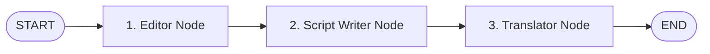
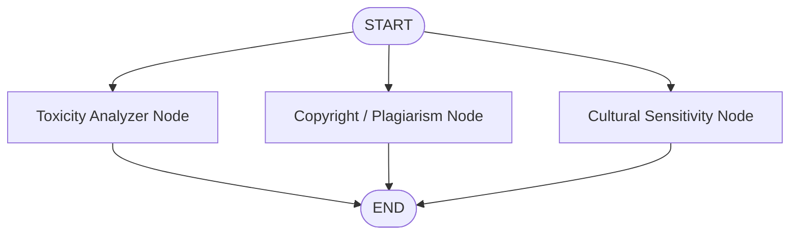

# Agent Architectures & LangGraph Workflows

This module covers AI agent patterns and stateful graph workflows built with **LangChain** and **LangGraph**, ranging from tool-calling agents with Human-in-the-Loop (HITL) middleware to multi-stage sequential pipelines and parallel workflows with state reducers.

---

## 📁 Directory Structure

```text
agents/
├── langchain/
│   ├── create_agent.py                 # Modern agent with middleware (wrap_tool_call) & HITL approval
│   └── manual_agents.py                # Low-level manual ReAct agent loop with message state
│
├── langgraph/
│   ├── state.py                        # State schemas (TypedDict, Pydantic, Dataclass, MessagesState)
│   ├── sequential_workflow/
│   │   └── sequential_base.py          # Linear multi-stage pipeline (Editor -> Script Writer -> Translator)
│   └── parallel_workflow/
│       └── parallel_reducers.py        # Fan-out / fan-in parallel nodes with custom state reducers
│
└── README.md                           # Agent architecture documentation
```

---

## 🧠 1. LangGraph State Representation (`langgraph/state.py`)

In LangGraph, state is the single source of truth passed across all nodes in a graph. Each node receives the current state and returns a dictionary of state updates.

### Supported State Paradigms:

1. **`TypedDict`**:
   - Lightweight and standard Python type hints.
   - Ideal for straightforward key-value state objects.
   ```python
   class State(TypedDict):
       topic: str
       summary: str
       score: int
   ```

2. **`Pydantic BaseModel`**:
   - Provides runtime schema validation, data coercion, and custom field validators.
   ```python
   class State(BaseModel):
       topic: str
       summary: str = ""
       score: int

       @field_validator("score")
       def score_positive(cls, value):
           if value < 0:
               raise ValueError("score must be positive")
   ```

3. **`dataclass`**:
   - Clean object-oriented state representation using standard Python `@dataclass`.
   ```python
   @dataclass
   class State:
       topic: str
       summary: str = ""
       message: list = field(default_factory=list)
   ```

4. **`MessagesState`**:
   - Built-in LangGraph class pre-configured with `messages: Annotated[list[AnyMessage], add_messages]`.
   - Simplifies chat history management and conversational bots.
   ```python
   class State(MessagesState):
       user_name: str
       language: str
   ```

---

## ⛓️ 2. Sequential Multi-Stage Pipeline (`langgraph/sequential_workflow/sequential_base.py`)

A sequential graph coordinates linear transformations where each node depends on the output of the preceding stage.



### Workflow Steps:
1. **Editor (`editor_node`)**: Cleans grammar, removes typos, and refines tone from `raw_input`, writing to `edited_text`.
2. **Script Writer (`script_writer_node`)**: Formats the polished text into an engaging, structured educational video script with a strong hook, writing to `script_text`.
3. **Translator (`translator_node`)**: Converts the script into natural conversational Roman Urdu with English technical terms preserved, writing to `final_output`.

### Graph Construction:
```python
graph = StateGraph(PipelineState)

graph.add_node("editor", editor_node)
graph.add_node("script_writer", script_writer_node)
graph.add_node("translator", translator_node)

graph.add_edge(START, "editor")
graph.add_edge("editor", "script_writer")
graph.add_edge("script_writer", "translator")
graph.add_edge("translator", END)

app = graph.compile()
```

### Execution:
```bash
python agents/langgraph/sequential_workflow/sequential_base.py
```

---

## ⚡ 3. Parallel Workflows & Custom Reducers (`langgraph/parallel_workflow/parallel_reducers.py`)

When multiple independent evaluations or analyses must run concurrently against the same input, LangGraph executes nodes in parallel (Fan-Out / Fan-In).



### The State Conflict Challenge & Reducers:
By default, if multiple parallel nodes write to the same state key, LangGraph will raise an invalid update conflict or overwrite values.

To resolve this, we use **Reducers** with Python's `Annotated`:

```python
def merge_score_dicts(existing: dict, new_update: dict) -> dict:
    """Merges concurrent dictionary updates into the existing state."""
    if existing is None:
        return new_update
    return {**existing, **new_update}

class AnalyzerState(TypedDict):
    raw_text: str
    safety_scores: Annotated[dict[str, int], merge_score_dicts]
```

### Parallel Node Operation:
- `toxicity_node` -> returns `{"safety_scores": {"toxicity_level": score}}`
- `copyright_node` -> returns `{"safety_scores": {"copyright_level": score}}`
- `culture_node` -> returns `{"safety_scores": {"cultural_sensitivity_level": score}}`

All three nodes execute concurrently from `START`, and `merge_score_dicts` seamlessly merges all scores into a single composite dictionary:
```json
{
  "copyright_level": 10,
  "cultural_sensitivity_level": 0,
  "toxicity_level": 90
}
```

### Execution:
```bash
python agents/langgraph/parallel_workflow/parallel_reducers.py
```

---

## 🤖 4. LangChain Agents (`agents/langchain/`)

### High-Level Agent with Middleware (`create_agent.py`)
- Built with LangChain's `create_agent`.
- Features `@wrap_tool_call` middleware to intercept tool invocations before execution and request interactive Human-in-the-Loop approval via CLI.
- Integrated tools:
  - `get_weather`: Live weather data via OpenWeatherMap API.
  - `get_news`: Live news retrieval via Tavily Search API.

### Low-Level Manual Agent Loop (`manual_agents.py`)
- Full control implementation of an iterative ReAct agent loop.
- Manages state using explicit `BaseMessage` structures (`HumanMessage`, `AIMessage`, `ToolMessage`, `SystemMessage`).
- Demonstrates tool resolution, dynamic arguments passing, permission denials, and error recovery.

### Execution:
```bash
# Run high-level agent with HITL middleware
python agents/langchain/create_agent.py

# Run manual loop agent
python agents/langchain/manual_agents.py
```
